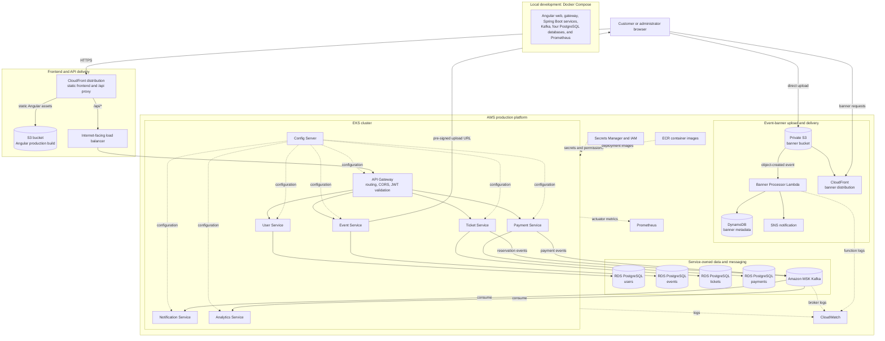

# PulseTickets

PulseTickets is a cloud-native event-ticketing platform built with Java 17, Spring Boot, Angular, PostgreSQL, Kafka, Docker, Kubernetes, and AWS.

Customers can browse events, register or sign in, reserve tickets, and record payments. Administrators can create events and upload event banners.

## High-level architecture



In production, CloudFront serves the Angular application from S3 and forwards `/api/*` requests to the internet-facing load balancer and API Gateway in EKS. Each main business service owns its PostgreSQL database. Kafka handles asynchronous reservation and payment events, while banner uploads go directly from an administrator's browser to S3 using a pre-signed URL, then trigger Lambda, DynamoDB, and SNS processing. Docker Compose provides the local equivalent of the application and data layers.

## Services

| Component | Responsibility |
|---|---|
| `web` | Angular customer and administrator interface |
| `api-gateway` | Single API entry point, routing, CORS, and JWT validation |
| `user-service` | Registration, login, profiles, roles, and JWT issuing |
| `event-service` | Event catalog, search, inventory, and banner URLs |
| `ticket-service` | Reservations, cancellations, and inventory coordination |
| `payment-service` | Payment records and payment events |
| `notification-service` | Kafka-based reservation and payment notifications |
| `analytics-service` | Kafka-based reservation metrics |
| `config-server` | Centralized Spring configuration |
| `banner-processor` | AWS Lambda handler for uploaded banner metadata |

## Run locally

Set the required environment variables in a `.env` file, including `JWT_SECRET`, then run:

```bash
docker compose up --build
```

Open the application at [http://localhost:4200](http://localhost:4200). The API Gateway is available at [http://localhost:8080](http://localhost:8080), and Prometheus is available at [http://localhost:9090](http://localhost:9090).

For Angular development outside Docker:

```bash
cd web
npm install
npm start
```

The local Compose stack includes Kafka, four PostgreSQL databases, the backend services, the gateway, the configuration server, the frontend, and Prometheus.

## Database schemas

Flyway migrations are stored inside each service:

- `user-service`: `users`
- `event-service`: `events`
- `ticket-service`: `reservations`
- `payment-service`: `payments`

The notification and analytics workers use `processed_messages` for Kafka idempotency. Their local configuration uses in-memory H2 databases.

## API summary

Public endpoints:

- `POST /api/auth/register`
- `POST /api/auth/login`
- `GET /api/events`
- `GET /api/events/{id}`

Authenticated endpoints support profiles, reservations, cancellations, and payments. Administrator-only endpoints support event creation, updates, deletion, and banner uploads. Authenticated requests use `Authorization: Bearer <token>`.

## AWS and production deployment

Terraform files are in [`infra/terraform`](infra/terraform). The production design uses:

- **EKS and ECR** for Kubernetes workloads and container images.
- **RDS PostgreSQL** for service databases.
- **MSK** for managed Kafka.
- **S3 and CloudFront** for frontend and banner storage and delivery.
- **Lambda, DynamoDB, and SNS** for banner processing and notifications.
- **Secrets Manager and IAM** for secrets and service permissions.
- **CloudWatch Logs** for AWS and Kafka logs.

The deployment script is [`scripts/deploy-production.sh`](scripts/deploy-production.sh). Review Terraform variables and the plan before applying infrastructure.

## Monitoring

All Spring Boot services expose:

- `/actuator/health`
- `/actuator/prometheus`

Prometheus configuration and alert rules are in [`monitoring`](monitoring). Operational notes are in [`docs`](docs).
